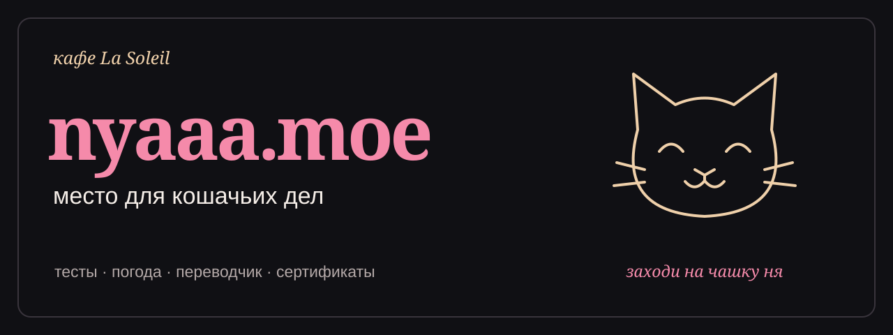

[](https://nyaaa.moe/)

<p align="center">
  <a href="https://nyaaa.moe/"><strong>Зайти в кафе</strong></a> ·
  <a href="https://nyaaa.moe/quiz.html">Пройти тест</a> ·
  <a href="https://nyaaa.moe/api.html">Посмотреть API</a>
</p>

# nyaaa.moe

Ночное меню кафе La Soleil: кошачьи тесты, маленькие инструменты и гайд с сертификатом няши. Заходи, Чокола уже разливает кофе.

## Сегодня в меню

| Раздел | Что попробовать |
| --- | --- |
| [Кошачьи тесты](https://nyaaa.moe/quiz.html) | Характер, архетипы, головоломка и короткие тесты |
| [Как стать няшей](https://nyaaa.moe/guide.html) | Десять шагов и персональный сертификат |
| [Няшки сайта](https://nyaaa.moe/nyashki.html) | Книга обладателей сертификатов |
| [Кото-погода](https://nyaaa.moe/weather.html) | Прогноз на кошачьем языке |
| [Ня-переводчик](https://nyaaa.moe/translator.html) | Одна фраза, шесть кошачьих голосов |
| [Ня-метаданные](https://nyaaa.moe/meta.html) | Что браузер рассказывает о тебе |
| [Ня-API](https://nyaaa.moe/api.html) | Мяу-числа и цитаты в JSON |

## Под капотом

**HTML · CSS · JavaScript · Cloudflare Workers · D1 · Groq**

Страницы работают на обычном JavaScript. Cloudflare Assets отдаёт статику, Worker обслуживает `/api/*`, D1 хранит прогресс и сертификаты, а Groq помогает переводчику говорить по-кошачьи.

## Открыть кафе локально

Нужны Node.js и npm. Из корня репозитория:

```sh
npm ci
npx wrangler d1 migrations apply nyaaa-moe --local
npm run dev:cloudflare
```

Открой адрес, который напечатает Wrangler. Для переводчика добавь `GROQ_API_KEY` в локальный `.dev.vars` — этот файл исключён из Git.

```sh
npm test       # тесты API и интерфейса через jsdom
npm run build # подготовка статики в dist/
```

## Для тех, кто за стойкой

- [Деплой, секреты и база данных](docs/DEPLOYMENT.md)
- [Сертификаты](CERTIFICATES.md)
- `worker/` — API и работа с D1; `migrations/` — схема базы.
- `netlify/` — прежние функции, сохранённые для отката.

---

Сделано [Falkorq](https://github.com/Falkorq). Личная страница — [falkorq.moe](https://falkorq.moe/).
